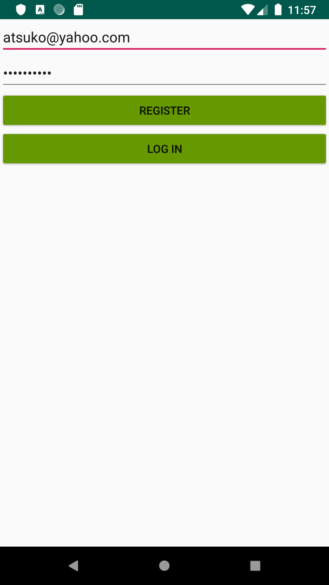
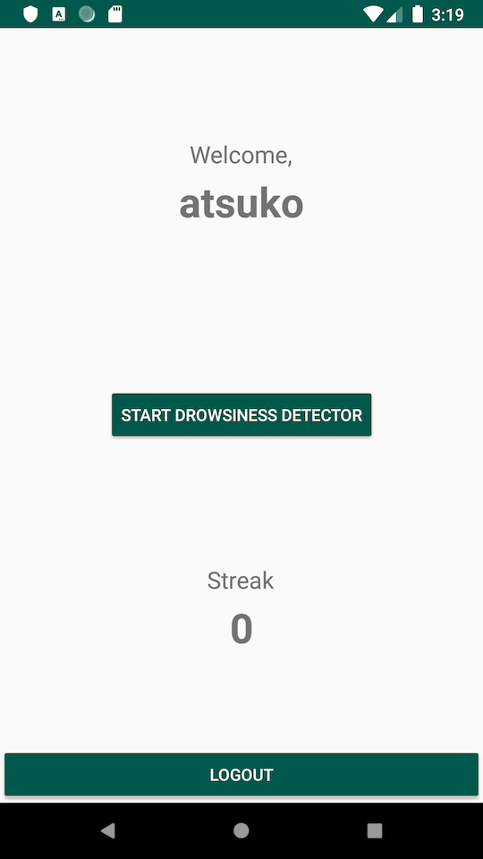

# Drowsiness Detector Android App

## How to Run
First, set up an AWS server (or a local server) and have it run `detectionserver.py`. The server should start listening to a port.
1. Clone this repository `git clone https://github.com/gwint/Drowsiness-Detection.git`
2. Download and open [Android Studio](https://developer.android.com/studio/install)
3. Click `Open an Existing Android Studio Project` from Android Studio, and load the directory at the path: `Drowsiness-Detection/Android/DrowsinessDetector`
4. Open `CameraActivity.java` in Android Studio (under `app/java/com.example.drowsinessdetector/` and set the private `String` data member named `serverUrl` to the server's URL. The URL must contain `http://`.
5. If you want to run the app on an Android device, plug the device into the computer. Else, the app will run on an emulator provided by Android Studio. Click the top-right triangle button `Run App` to build and launch the app.

### Running with Test Server Locally (using campus network)
If not running on an AWS server, you can run the server locally.
1. Create a WiFi hotspot with personal phone. Then connect laptop (where server script will run) and Android phone to the WiFi hotspot.
2. Obtain the new IP address of the laptop and correctly set the IP address in `CameraActivity.java` at `serverUrl`. Also change the IP address in the server script `detectionserver.py`.
3. Start the server by running `python3 /detection-api/detectionserver.py` server.
4. Start the app from Android Studio.

## Using the App
1. First, register a new username and password. Then enter your crendentials into the login page:

2. Once logged in, you will enter the home screen, where your streak value is displayed. From here, you can start the camera by tapping the `START DROWSINESS DETECTOR` button.

3. Once the camera has started, you can start recording by pressing `RECORD`. The camera will start recording and the backend server will start processing the recorded videos. To stop recording, press `STOP`; you will be taken back to the home screen. If drowsiness was not detected in this session, then the streak counter will be incremented when logged back in. Else, the streak counter will be reset to zero when logged back in.

## Databases
1. We used Firebase Database to keep a record of users and their streak count.
2. Currently, the project uses the database created using my google account. In case you want to change the database, go to the link "https://console.firebase.google.com/" and create your own database. Replace the google-services.json file in the project with the one you download from Firebase.
3. In your Firebase project, under the "Authentication" tab go to the "Sign-in Method" and enable "Email/Password".
4. Then go to the "Database" tab and select "Realtime Database". Go to "Rules" and set ".read: true" and ".write: true"

## Java Classes
Custom Java classes are located in: `DrowsinessDetector/app/src/main/java/com/example/drowsinessdetector/`:
* `MainActivity` The login page when the app is first launched.
* `HomeActivity` The main menu of the app once the user logs in. From here, the user can start the detector camera, or check their streak.
* `CameraActivity` Detector camera. Video recorded through this screen is sent to the AWS server for analysis.
* `CameraPreview` Helper class of `CameraActivity`. Sets up the Camera object and displays the camera preview in the `CameraActivity`'s layout.
* `VideoSender` Background thread that sends the video to AWS server

## Resources
* Android
    * [Developer Fundamentals](https://codelabs.developers.google.com/android-training/)
    * [Documentation](https://developer.android.com/docs/)
    * [Camera API](https://developer.android.com/guide/topics/media/camera#custom-camera)
	* [HttpURLConnection](https://developer.android.com/reference/java/net/HttpURLConnection.html)
	* [AsyncTask](https://developer.android.com/reference/android/os/AsyncTask)
